# IEEE-CIS Fraud Detection MLOps Platform

> A complete production-style MLOps solution for fraud detection, covering training, deployment, monitoring, drift detection, alerting, CI/CD, and explainability.

## Problem

Financial platforms process thousands of transactions every minute, and even a small number of missed fraud cases can create major business loss. A production fraud system must do more than train a model: it must detect fraud with high recall, handle class imbalance, monitor model and data behavior, and automatically trigger retraining when performance degrades.

This project solves that problem using the IEEE-CIS Fraud Detection dataset and a complete MLOps workflow.

## What I Built

I built an end-to-end fraud detection MLOps system that includes:

- Real IEEE-CIS fraud dataset training pipeline
- Missing-value handling and high-cardinality categorical encoding
- Comparison of imbalance strategies: `class_weight` and `SMOTE`
- Model comparison: XGBoost, LightGBM, and hybrid Random Forest with feature selection
- Cost-sensitive learning to penalize false negatives
- Precision, recall, F1-score, AUC-ROC, and confusion matrix evaluation
- Time-based drift simulation and drift scoring
- SHAP explainability for fraud predictions
- FastAPI inference service with Prometheus metrics
- Docker images for training and inference
- Kubernetes deployment with namespace, quotas, PV/PVC, and service
- Kubeflow Pipelines workflow with retries and conditional deployment
- Jenkins CI/CD pipeline triggered by monitoring alerts
- Prometheus, Alertmanager, and Grafana monitoring stack
- Word report with evidence screenshots and requirement coverage

## Solution Architecture

```text
IEEE-CIS Data
   |
   v
Data Validation -> Preprocessing -> Feature Engineering
   |
   v
Model Training: XGBoost / LightGBM / Hybrid RF
   |
   v
Evaluation: Precision, Recall, F1, AUC-ROC, Confusion Matrix
   |
   v
Conditional Deployment through Kubeflow/Kubernetes
   |
   v
FastAPI Fraud Inference Service
   |
   v
Prometheus + Grafana Monitoring
   |
   v
Alertmanager -> Jenkins CI/CD Retraining Trigger
```

## Key Result

The final real-data run selected:

- Best model: `XGBoost`
- Imbalance strategy: `class_weight`
- Cost strategy: `cost_sensitive`
- Recall: `0.999753937007874`
- AUC-ROC: `0.8941891839491015`

This prioritizes catching fraud cases, which is the most important business objective in fraud detection.

## Repository Structure

```text
src/fraud_mlops/        Core ML, API, drift, monitoring, and trigger code
kubeflow/               Kubeflow pipeline definition
k8s/                    Kubernetes namespace, quota, PV/PVC, deployment, service
monitoring/             Prometheus, Alertmanager, and Grafana configs
jenkins/                Jenkins pipeline job and local Jenkins Docker setup
configs/                Training configuration
docs/                   Report, screenshots, runbook, requirement coverage
scripts/                Data/evidence/report helper scripts
tests/                  Lightweight validation tests
```

## Evidence and Report

The project includes a full assignment report with screenshots and explanations:

- `docs/research_report.docx`
- `docs/research_report.md`
- `docs/requirement_coverage.md`
- `docs/evidence/`

The evidence covers:

- dataset extraction
- training summary
- confusion matrix
- model comparison
- drift analysis
- Kubeflow pipeline evidence
- Kubernetes deployment evidence
- Docker and Jenkins CI/CD evidence
- API inference evidence
- Prometheus/Grafana monitoring evidence
- alert-triggered retraining evidence

## Visual Walkthrough

### 1. Real IEEE-CIS Dataset

The project uses the real IEEE-CIS fraud detection training files and confirms the fraud rate and dataset size before training.

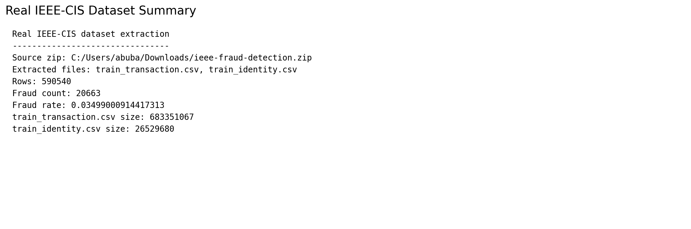

### 2. Training Summary

Multiple fraud models and strategies were trained and compared. The final selected model prioritized fraud recall.

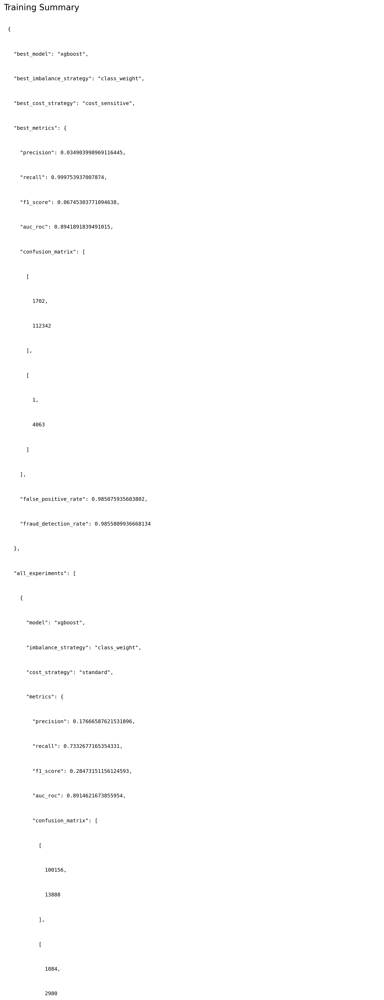

### 3. Fraud Confusion Matrix

The confusion matrix shows the fraud/legitimate classification trade-off and supports recall-focused business analysis.

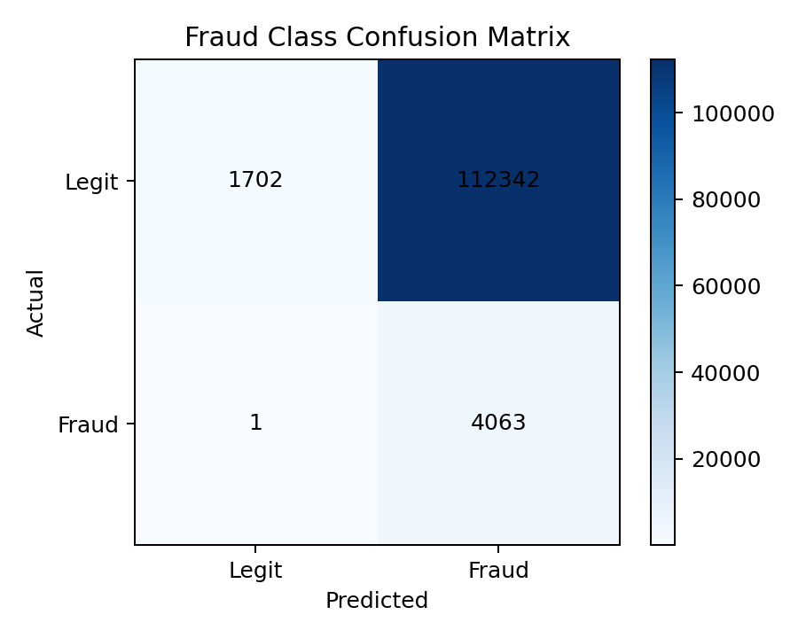

### 4. Model and Strategy Comparison

This comparison shows the behavior of XGBoost, LightGBM, and hybrid Random Forest under imbalance and cost-sensitive strategies.

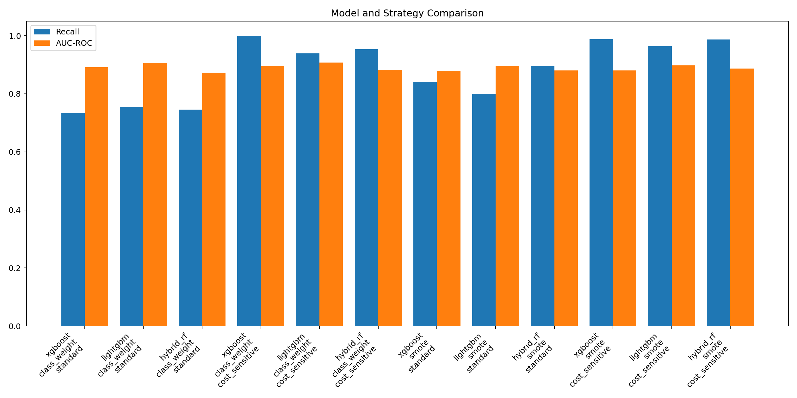

### 5. Drift Detection

The project simulates time-based drift and identifies features whose distributions changed over time.

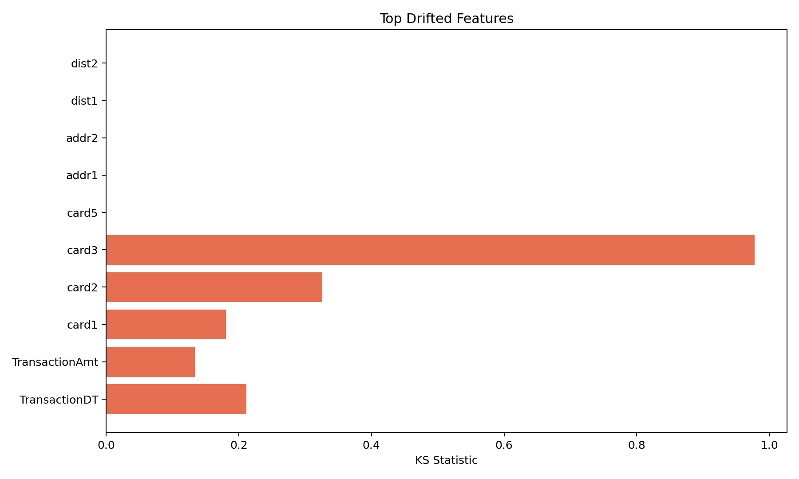

### 6. Kubeflow Pipelines

Kubeflow Pipelines was used to represent the ML workflow with retries and conditional deployment.

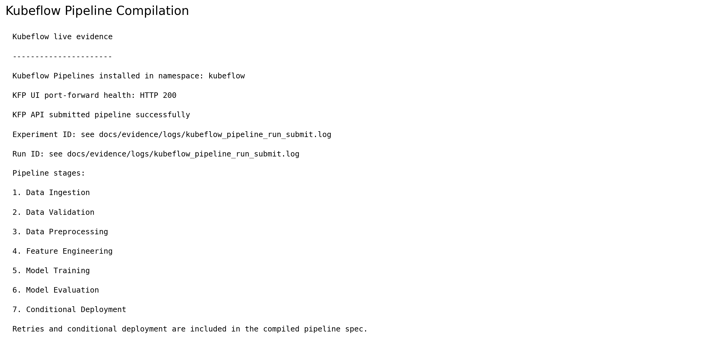

### 7. Kubernetes Deployment

The inference API was deployed into Kubernetes with namespace isolation, resource configuration, and service exposure.

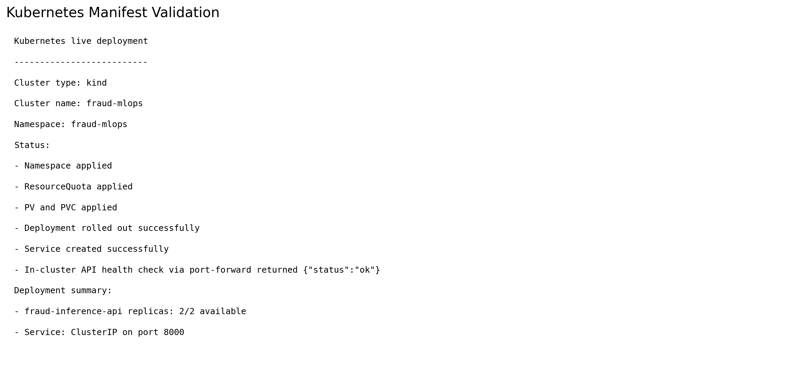

### 8. Docker and CI/CD

Training and inference Docker images were built, pushed to a local registry, and integrated with Jenkins CI/CD.

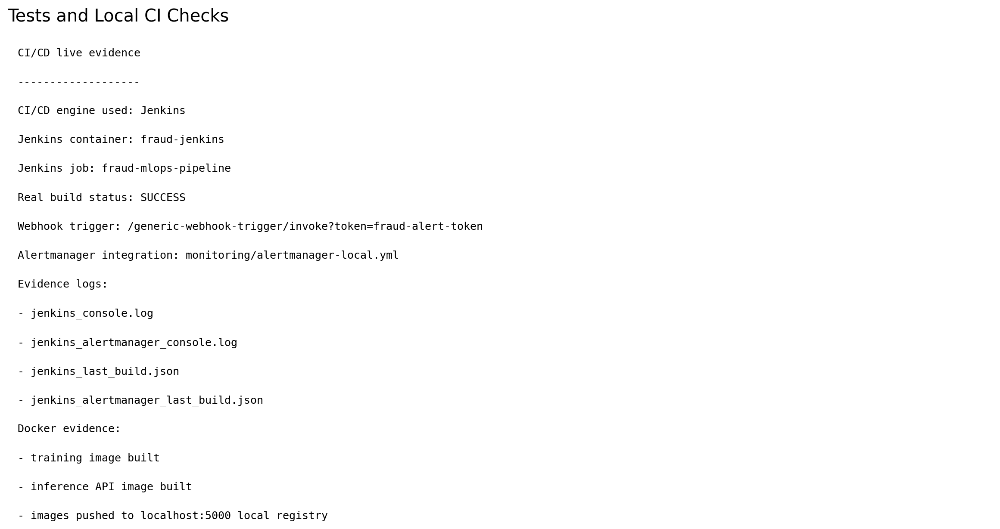

### 9. Live API Inference

The FastAPI inference service exposes health, prediction, and Prometheus metrics endpoints.

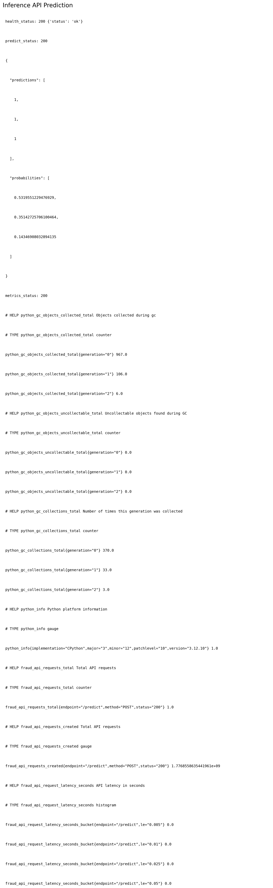

### 10. Prometheus and Grafana Monitoring

Prometheus collects metrics, while Grafana dashboards visualize system health, model performance, and data drift.

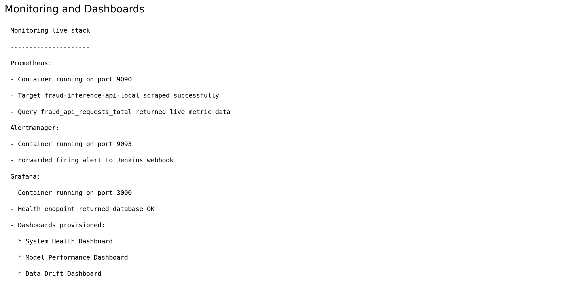

### 11. Alert-Triggered Retraining

Prometheus alerts are routed through Alertmanager and trigger Jenkins retraining workflow execution.

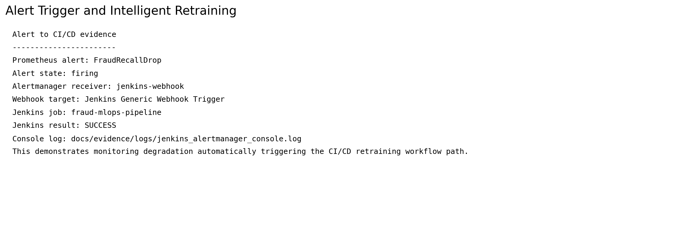

### 12. Final Submission Structure

The final project contains source code, configs, reports, monitoring files, Kubernetes manifests, Jenkins files, and evidence artifacts.

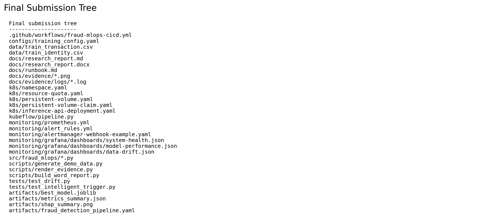

### 13. Transaction Distribution

The project also includes dataset exploration visuals for quick fraud-data understanding.

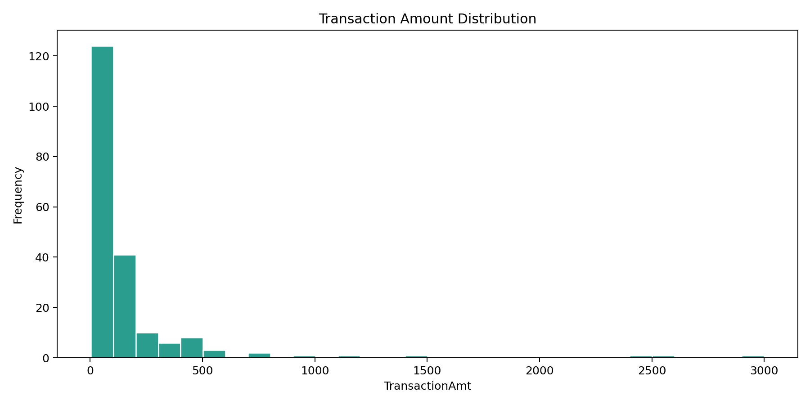

## How To Run

### 1. Install Dependencies

```powershell
python -m venv .venv
.venv\Scripts\Activate.ps1
pip install -e .
```

### 2. Add Dataset

Download the IEEE-CIS Fraud Detection dataset from Kaggle and place:

```text
data/train_transaction.csv
data/train_identity.csv
```

### 3. Train Models

```powershell
$env:PYTHONPATH = (Resolve-Path src).Path
python -m fraud_mlops.train --config configs/training_config.yaml
```

### 4. Run API

```powershell
uvicorn fraud_mlops.inference_api:app --host 0.0.0.0 --port 8000
```

### 5. Build Docker Images

```powershell
docker build -f Dockerfile.training -t fraud-training:local .
docker build -f Dockerfile.api -t fraud-inference-api:local .
```

### 6. Compile Kubeflow Pipeline

```powershell
python kubeflow/pipeline.py
```

### 7. Deploy Kubernetes Manifests

```powershell
kubectl apply -f k8s/namespace.yaml
kubectl apply -f k8s/resource-quota.yaml
kubectl apply -f k8s/persistent-volume.yaml
kubectl apply -f k8s/persistent-volume-claim.yaml
kubectl apply -f k8s/inference-api-deployment.yaml
```

## Business Impact

The system is designed for fraud-heavy business risk:

- Higher recall reduces missed fraud losses
- Cost-sensitive learning penalizes false negatives
- Monitoring catches recall degradation and data drift
- Alertmanager and Jenkins automate retraining triggers
- SHAP explainability supports fraud investigation and audit review

## Notes

Large generated files are intentionally excluded from GitHub:

- Kaggle CSV files
- trained model binaries
- submission zip files
- local cluster binaries

These can be regenerated using the documented pipeline and scripts.
